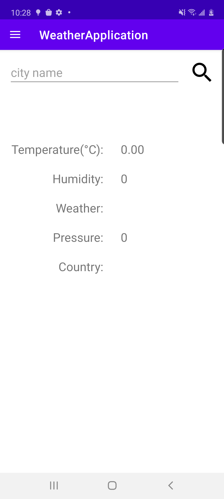

# WeatherApplication
Welcome to WeatherApplication. For this project, I make use of Hilt, MVVM, Retrofit, Room, Kotlin Coroutine, DrawerLayout and data binding to build the main structure.

## Getting Started

Check out the project.
```
git clone https://github.com/chenccc/WeatherApplication.git
```

In local.properties, add api key for open weather, like the following one.

api.key=xxxxxxxxx

## Main pages
In this project, there are two main pages, namely [HomeFragment](app/src/main/java/com/james/weatherapplication/ui/home/HomeFragment.kt) and [DrawerFragment](app/src/main/java/com/james/weatherapplication/ui/drawer/DrawerFragment.kt).

For HomeFragment, there is a search bar for user to search weather for specific city and will show the weather for last access city when app restarts.




For DrawerFragment, a list of recent search cities will be there. We can click the city name to get the weather for the city in HomeFragment. 
What is more, we can delete the history of each city.


## Core logic
For getting weather for a city, we can take a look at the code snippet below in [WeatherRepositoryImpl](app/src/main/java/com/james/weatherapplication/data/repository/WeatherRepositoryImpl.kt).

    override suspend fun getWeatherForCity(city: String): CityWeather {
        // retrieve weather of city from db
        db.cityWeatherDao().getWeatherForCity(city.uppercase())?.let {
            if (!NetworkUtils.isNetworkConnected(appContext)) {
                insertWeatherToDB(it.copy(lastAccessTime = System.currentTimeMillis()))
                return it
            }
        }

        // retrieve weather of city from api
        return service.getWeatherForCity(
            city = city,
            appID = appContext.resources.getString(R.string.api_key)
        ).apply {
            if (cod == Constants.GOOD_RESPONSE) {
                insertWeatherToDB(this.copy(lastAccessTime = System.currentTimeMillis()))
            }
        }
    }
    
We will first try to get weather information of the city from Room database. If we can find the info in DB and the device is not connected to network, we will simply return the weather info from DB and update the lastAccessTime. Otherwise, we will try to get the weather info from weather api. Only when we can get the correct reponse from api, we will insert the info to DB with current time as lastAccessTime. What is more, if we meet any exception during this process, we will catch it and put the exception message into errorMessage, which will be shown as a toast.

## Unit test
Currently, I have covered testing for homeViewModel, DrawerViewModel, WeatherRepository and CityWeatherDao.
Testing for HomeFragment and DrawerFragment is still pending at this moment.

